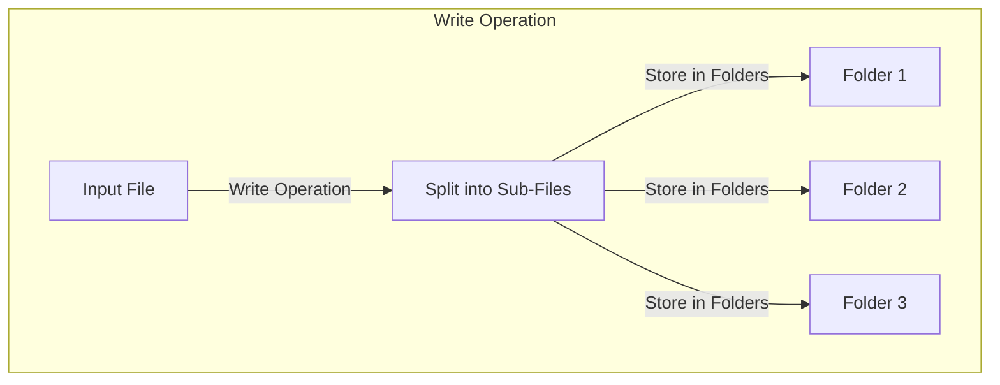
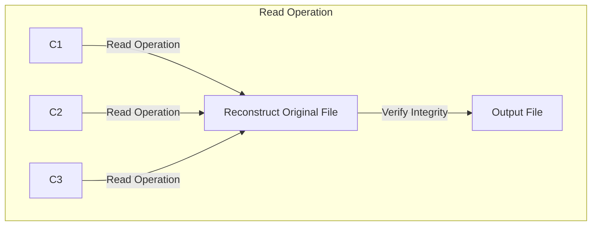

# Distributed File Management

**Distributed File Management** is a Java utility that facilitates the distributed storage and retrieval of files. It allows you to split a large file into smaller sub-files and store them in dynamically created folders based on hash values. Subsequently, you can read these sub-files and reconstruct the original file.

## Functionality

### Writing Files

The `DistributedFile` utility provides a way to split a large file into smaller parts and store them in dynamically created folders. The process involves:

1. **Input File**: Specify the path to the input file that you want to split.
2. **Output Directory**: Specify the directory where sub-files will be stored based on their hash values.
3. **Hashing**: Each sub-file is associated with a hash value, and a dynamically created folder is named after the hash.
4. **Storage**: Sub-files are stored in their respective hash-named folders.





### Reading Files

To reconstruct the original file from the sub-files, the utility performs the following steps:

1. **Input Directory**: Specify the directory containing the sub-files.
2. **Output File**: Specify the path where the reconstructed file will be saved.
3. **Verification**: Hash values are used to verify the integrity of sub-files during the reconstruction process.
4. **Reconstruction**: Sub-files are read and concatenated to reconstruct the original file.



## Usage

### Writing Files:

```bash
java -jar distributed-file.jar write <inputFilePath> <outputDirectory>
```

### Reading Files:

```bash
java -jar distributed-file.jar read <inputDirectory> <outputFilePath>
``` 


